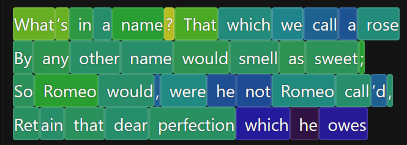
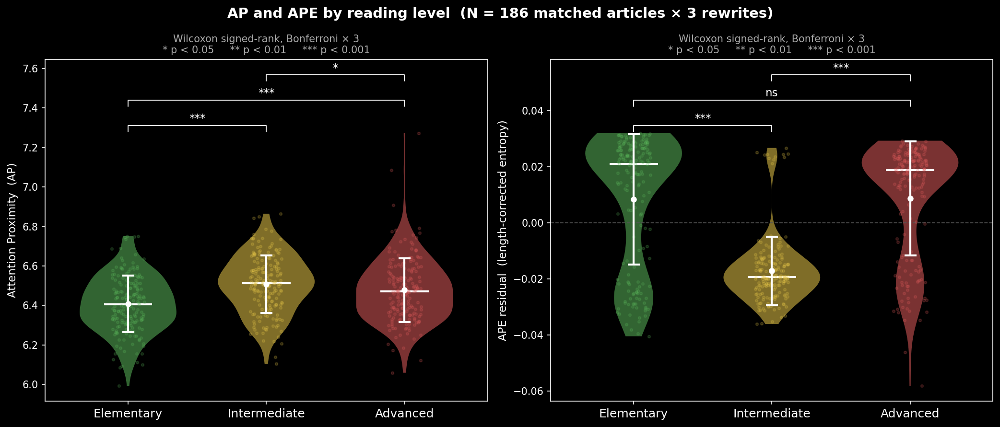

*If you want to run Attention Proximity scoring on your own text, the source code is available on GitHub [here](https://github.com/wilestk/attention-proximity-app).*

*The above image is from the interactive visualization widget [at the bottom of this page](#ap-examples).*

---

# LLM Attention Proximity Heatmaps

## Quantifying and Visualizing LLM Internals

### Intro

Large Language Models (LLMs) operate by first breaking down input text into subcomponents called "tokens". LLMs then generate sophisticated linguistic responses to the input tokenset by iteratively predicting which token is next in the written sequence. An LLM stores polydimensional vector embeddings of each token in its context window and combinatorially compares N tokens via multiple attention heads. A single attention head process results in an N x N vector-alignment comparison matrix accomplished by taking the scaled dot product between each token's Query (Q) and Key (K) projections. Here, I've leveraged this internal architecture to generate a language quantification and visualization tool I call Attention Proximity (AP), which intercepts these internal LLM combinatorial token relational maps and generates a quantifiable score for an input text selection. The motivating hypothesis behind Attention Proximity is that more densely meaningful texts will yield higher internal interrelatedness as represented by LLM internals, and therefore higher AP.

---

### Methodology

 The LLM I'm using is Qwen3-8B, which has 32 attention heads per layer across 36 sequential transformer layers before outputting the result. From the final layer, I take all 32 heads' worth of matured token embeddings (Q and K projections) and generate a symmetrized NxN matrix of the average dot product relatedness of those projections:

$$
A_h = \frac{Q_h K_h^\top}{\sqrt{d_k}}, \quad h = 1, \dots, 32
$$

$$
A_{\text{raw}} = \frac{1}{32} \sum_{h=1}^{32} A_h
$$

$$
A = \frac{A_{\text{raw}} + A_{\text{raw}}^\top}{2}
$$

$$
\text{AP}_i = \frac{1}{N-1} \sum_{j \neq i} A_{ij}
$$

Where $Q_h, K_h \in \mathbb{R}^{N \times d_k}$ are the query and key projections for head $h$ at the final layer, $d_k$ is the head dimension, $N$ is the sequence length, and $A \in \mathbb{R}^{N \times N}$ is the symmetrized proximity matrix.

The average combinatorial relatedness internal to an input text is called its Attention Proximity (AP). The visualization tool uses a heatmap visualization to visualize how strongly each token's average relatedness to every other token, and the tool can be subsetted to view any single token or token group's average relatedness to every other token.

$$ \text{AP} = \frac{1}{N} \sum_{i=1}^{N} \text{AP}_i = \frac{1}{N(N-1)} \sum_{i=1}^{N} \sum_{j \neq i} A_{ij} $$

The scalar $\text{AP} \in \mathbb{R}$ summarizes the average pairwise proximity across all $N$ tokens in the input. For a selected subset $S \subseteq \{1, \dots, N\}$, the relative heatmap displays the average proximity of each token $j$ to the selection:

$$ \text{AP}_j^{(S)} = \frac{1}{|S|} \sum_{i \in S} A_{ij}, \quad j = 1, \dots, N $$

Each token *i* is also assigned an entropy score that measures how spread out its Attention Proximity score is across all of its neighbors. Attention Proximity Entropy (APE) of a set of tokens is the averaged entropy of all N tokens in an LLM input tokenset:

$$ \text{iAPE}_i = -\sum_{j \neq i} \hat{p}_{ij} \log \hat{p}_{ij}, \qquad \hat{p}_{ij} = \frac{A_{ij}}{\sum_{k \neq i} A_{ik}} $$

$$ \text{APE} = \frac{1}{N} \sum_{i=1}^{N} \text{iAPE}_i $$

---

### Results

Like I said in the intro, the motivating hypothesis behind Attention Proximity is that more densely meaningful texts will yield higher internal interrelatedness as represented by LLM internals, and therefore higher AP.

I've tested this hypothesis against the [OneStopEnglish](https://huggingface.co/datasets/) dataset, a collection of 189 Guardian newspaper articles each rewritten at three reading levels (Elementary, Intermediate, Advanced). The dataset was pared down to 186 after quality control, yielding 558 texts across matched triplets.

> **Figure 1 *(click to enlarge)*:**
> 
> *AP (left) and sample-token-length-corrected APE (right) by reading level across 186 matched article triplets. Error bars show ±1 SD. Brackets indicate pairwise Bonferroni-corrected Wilcoxon signed-rank tests.*

As hypothesized, AP increases as reading level increases, indicating more internal related richness as writing level advances, as represented by LLM internals.

Interestingly, the APE of both Elementary and Advanced writing is higher than the entropy of intermediate writing, implying that Advanced writing has both a richer and a wider internal relatedness than Intermediate writing. Beginner writing has a higher internal attention spread than Intermediate writing, which could mean that Intermediate writing accomplishes its increase in relational complexity primarily by reigning in lexical ambiguity and lexical "promiscuity" or vagueness. Increasing the writing level from Intermediate to Advanced may then require reintroducing more nuance into the lexical structure.

This mirrors common wisdom such as "If you can't explain something simply, you don't know it well enough". Ironic, since this article is going to be very difficult to parse for the average person!

---

### Visualization

The most fun part of this project was creating a visualization tool for AP.

I've provided a bunch of examples here for you to play with the tool, and also an [open source repo](https://github.com/wilestk/attention-proximity-app) if you want to examine the heatmaps of any arbitrary text on your local computer.

Click on individual tokens to subset the heatmap by token. Select more than one token by clicking and dragging. Shift click another token while one is selected to select all intervening tokens. Ctrl click to add single tokens to your selection.

---

{::nomarkdown}

{:/nomarkdown}
---

**want to contact me? kevinwiles11 at gmail**